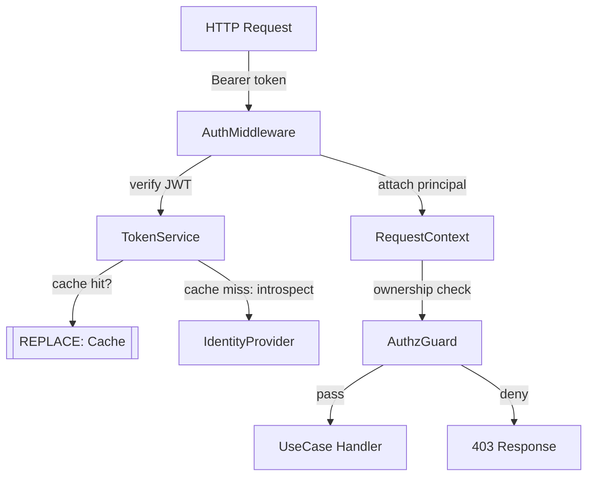

# Architecture: [PROJECT_NAME]

> **Template instruction:** Fill in each section for your project.
> Remove placeholder text and adapt diagrams to your actual system.
> Score each layer using `ARCHITECTURE_SCORING_PLAYBOOK.md` before Sprint 1.
>
> **Reference example below** uses a generic REST API + DB + Cache system.
> Replace all content between `<!-- EXAMPLE START -->` and `<!-- EXAMPLE END -->`
> with your project's actual architecture.

---

<!-- EXAMPLE START — generic REST API reference system -->

## 1. Fundamental Architectural Principles

- **Primary constraint:** Low latency for read-heavy workloads; consistency over availability for writes.
- **Scalability model:** Horizontal stateless API layer; vertical stateful data layer.
- **Security posture:** Defense-in-depth — input validation at boundary, authz checks at use-case layer, secrets never in code.
- **Coupling target:** Strict layering via Dependency Rule — domain layer has zero framework imports.

---

## 2. System Context (C4 Level 1)

```
[Web Browser / Mobile Client]
        |  HTTPS
        v
[System: REST API Service]   <--- [Admin Dashboard (internal)]
        |
        +---> [Identity Provider]  (OAuth 2.0 / OIDC)
        +---> [Object Storage]     (file uploads)
        +---> [Email Service]      (transactional email)
```

**Actors:**
| Actor | Interaction | Trust Level |
| :--- | :--- | :--- |
| End User | HTTPS REST calls via client app | Authenticated (JWT) |
| Admin | Internal dashboard | Authenticated + role:admin |
| Identity Provider | Token issuance / introspection | Trusted external |

---

## 3. Container Diagram (C4 Level 2)

```
[Client App]
    |  HTTPS / REST
    v
[API Server — [REPLACE: e.g. Node.js / Express]]
    |
    +---> [[REPLACE: Primary DB]]   (primary data store)
    +---> [[REPLACE: Cache]]        (session cache, rate-limit counters)
    +---> [Object Store]            (binary assets — S3-compatible)
```

**Containers:**
| Container | Technology | Responsibility |
| :--- | :--- | :--- |
| API Server | [REPLACE: e.g. Node.js 20, Express] | Request routing, auth, business logic orchestration |
| Primary DB | [REPLACE: e.g. PostgreSQL 16] | Persistent data |
| Cache | [REPLACE: e.g. Redis 7] | Session store, rate-limit counters |
| Object Store | [REPLACE: e.g. S3-compatible] | Binary asset storage (images, documents) |

---

## 4. Component Diagram (C4 Level 3) — Auth Subsystem

> The auth subsystem is the highest-risk component — documented here.



---

## 5. Layer Model

| Layer | Name           | Responsibility                | Key Files |
| :---: | :------------- | :---------------------------- | :-------- |
|  L1   | Foundation     | Runtime, env, config          | `src/config/`, `src/env.ts` |
|  L2   | Data           | Persistence, migrations       | `src/infrastructure/db/`, `migrations/` |
|  L3   | Domain         | Core business logic, entities | `src/domain/` |
|  L4   | Application    | Use cases, orchestration      | `src/application/` |
|  L5   | Infrastructure | External adapters, clients    | `src/infrastructure/` |
|  L6   | Interface      | Controllers, DTOs, validators | `src/interface/` |
|  L7   | Security       | Auth, authz, rate limiting    | `src/interface/middleware/` |
|  L8   | Observability  | Metrics, logging, tracing     | `src/observability/` |
|  L9   | Testing        | Unit, integration, E2E        | `tests/` |
|  L10  | Documentation  | Docs, governance, ADRs        | `.agent/context/`, `rfcs/` |

---

## 6. Execution and Runtime Model

- **Process model:** [REPLACE: e.g. Single process per container instance; horizontal scaling via container orchestration.]
- **Concurrency model:** [REPLACE: e.g. Single-threaded event loop; CPU-bound tasks offloaded to worker threads.]
- **Resource limits:** [REPLACE: e.g. memory cap, vCPU count, max DB connections, request timeout — derive from load-test baselines.]
- **Isolation strategy:** [REPLACE: e.g. One container per service; no shared mutable state between instances.]

---

## 7. Data Flow

```
[Client Request]
    --> [TLS Termination]
    --> [Rate Limit Check ([REPLACE: Cache])]
    --> [JWT Validation]
    --> [Input Validation + Sanitization]
    --> [Use Case Handler]
        --> [Domain Logic]
        --> [Repository ([REPLACE: Primary DB])]
    --> [Audit Log Entry]
    --> [Response Serialization]
    --> [Client Response]
```

All user-supplied data is validated and sanitized before reaching domain logic. PII is never written to application logs.

---

## 8. Deployment Architecture

| Environment | Infrastructure | Notes |
| :---------- | :------------- | :---- |
| Development | [REPLACE: e.g. Docker Compose (local)] | All services on localhost; hot-reload enabled |
| Staging | [REPLACE: e.g. Container cluster (single region)] | Mirrors prod topology; synthetic traffic injected |
| Production | [REPLACE: e.g. Container cluster (multi-AZ)] | [REPLACE: e.g. Auto-scale on CPU > 70%; blue-green deploys] |

**Secrets management:** Environment variables injected at runtime from secrets manager (never in image or repo).
**Network segmentation:** API server in public subnet; DB and cache in private subnet; no direct internet access to data layer.

---

## 9. Dependency Graph (Key)

| Dependency | Version | Purpose | Risk Notes |
| :--------- | :------ | :------ | :--------- |
| [REPLACE: e.g. `express`] | [REPLACE: e.g. 4.x] | [REPLACE: e.g. HTTP framework] | [REPLACE: risk notes] |
| [REPLACE: e.g. `jsonwebtoken`] | [REPLACE: e.g. 9.x] | [REPLACE: e.g. JWT sign/verify] | [REPLACE: risk notes] |

---

## 10. Architecture Decision Records (ADRs)

| ID | Decision | Status | Date |
| :--- | :--- | :--- | :--- |
| ADR-001 | [REPLACE: e.g. Use PostgreSQL over NoSQL — relational data model, strong consistency required] | Example | [YYYY-MM-DD] |
| ADR-002 | [REPLACE: e.g. Reject microservices — team size < 5, monolith preferred until clear seam emerges] | Example | [YYYY-MM-DD] |

> Full ADRs live in `rfcs/` — this table is the quick reference.

<!-- EXAMPLE END -->
