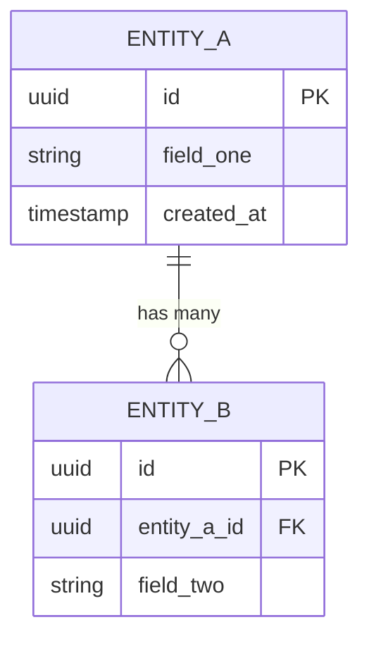

# Data Model — [PROJECT_NAME]

> **Template instruction:** Fill in each section for your project.
> Keep this document in sync with migration files — a divergence is a doc bug.
> Update after every schema-changing migration. Archive old versions in revision history.

---

## 1. Domain Overview

Brief description of the core domain and the main entities it models.

**Bounded contexts** (if applicable):

| Context       | Entities                 | Owns                                  |
| :------------ | :----------------------- | :------------------------------------ |
| `[Context A]` | `[Entity1]`, `[Entity2]` | `[what data it is authoritative for]` |
| `[Context B]` | `[Entity3]`              | `[what data it is authoritative for]` |

---

## 2. Entity Definitions

> One subsection per aggregate root. Include all fields with type, constraints, and rationale for non-obvious decisions.

### 2.1 `[Entity A]`

**Table / Collection:** `[table_name]`
**Aggregate root:** yes / no
**Owns:** `[list of child entities or value objects]`

| Field          | Type      | Constraints                            | Description                                            |
| :------------- | :-------- | :------------------------------------- | :----------------------------------------------------- |
| `id`           | UUID v4   | PK, NOT NULL                           | Surrogate key — never expose sequential IDs externally |
| `[field_name]` | `[type]`  | `[NOT NULL / UNIQUE / FK → table.col]` | `[description]`                                        |
| `created_at`   | TIMESTAMP | NOT NULL, DEFAULT NOW()                | Immutable — set on insert, never updated               |
| `updated_at`   | TIMESTAMP | NOT NULL                               | Updated by application layer on every write            |
| `deleted_at`   | TIMESTAMP | NULLABLE                               | Soft-delete marker — NULL means active                 |

**Indexes:**

| Name         | Columns        | Type               | Rationale                   |
| :----------- | :------------- | :----------------- | :-------------------------- |
| `[idx_name]` | `[col1, col2]` | BTREE / GIN / GiST | `[query pattern it serves]` |

**Business rules enforced at DB level:**

- `[rule, e.g.: CHECK(status IN ('pending','active','closed'))]`

---

### 2.2 `[Entity B]`

**Table / Collection:** `[table_name]`
**Parent:** `[Entity A]` (via `[entity_a_id]`)

| Field           | Type     | Constraints                    | Description      |
| :-------------- | :------- | :----------------------------- | :--------------- |
| `id`            | UUID v4  | PK, NOT NULL                   |                  |
| `[entity_a_id]` | UUID     | FK → `[entity_a].id`, NOT NULL | Owning aggregate |
| `[field_name]`  | `[type]` | `[constraints]`                | `[description]`  |

---

## 3. Entity Relationship Diagram

```
[Entity A] 1──< [Entity B]
     |
     └──< [Entity C]

[Entity D] >──< [Entity A]   (many-to-many via [join_table])
```

> Replace with a Mermaid ERD once entities are defined:



---

## 4. Relationship Summary

| Relationship                | Cardinality | FK Location            | Cascade                   |
| :-------------------------- | :---------- | :--------------------- | :------------------------ |
| `[Entity A]` → `[Entity B]` | 1 : N       | `entity_b.entity_a_id` | DELETE CASCADE / RESTRICT |
| `[Entity A]` ↔ `[Entity D]` | N : M       | `[join_table]`         | DELETE CASCADE both sides |

---

## 5. Enum and Lookup Tables

| Enum / Table | Values                                    | Used By      |
| :----------- | :---------------------------------------- | :----------- |
| `[status]`   | `pending`, `active`, `closed`, `archived` | `[Entity A]` |
| `[role]`     | `admin`, `member`, `viewer`               | `[Entity B]` |

---

## 6. Soft Delete Strategy

**Policy:** `[hard delete / soft delete via deleted_at / archive to separate table]`

Rules:

- Soft-deleted records are excluded from all application queries via a default scope or query filter.
- Cascading soft-delete: deleting `[Entity A]` soft-deletes its `[Entity B]` children.
- Hard-delete is reserved for: `[data erasure requests (GDPR) / test data / specify]`.
- Restoration procedure: `[describe or reference runbook]`.

---

## 7. Migration Strategy

**Tool:** `[Flyway / Liquibase / Alembic / node-pg-migrate / Prisma Migrate / other]`
**Location:** `[db/migrations/ or prisma/migrations/]`
**Naming:** `V{version}__{description}.sql` or tool-native format.

### Rules

- **No destructive migrations on live data** without a backfill + dual-read/write phase.
- **Column removal lifecycle:**
  1. Stop writing to column.
  2. Deploy and verify.
  3. Drop column in a subsequent release.
- **Zero-downtime migrations:** Additive-only changes (add column, add index CONCURRENTLY). Never rename or drop in a single step.
- **Rollback:** Every migration must have a tested `down` script or explicit "irreversible" annotation.

### Migration checklist

- [ ] Migration is additive or follows the dual-write pattern.
- [ ] `down` script written and tested locally.
- [ ] Indexes created with `CONCURRENTLY` (Postgres) or equivalent.
- [ ] Performance impact estimated for table sizes > 1M rows.
- [ ] Reviewed by at least one other engineer.
- [ ] Runbook updated if operational procedure changes.

---

## 8. Data Retention and Archival

| Entity        | Retention                    | Archival Target                | Legal Basis                      |
| :------------ | :--------------------------- | :----------------------------- | :------------------------------- |
| `[Entity A]`  | `[N years after deleted_at]` | `[cold storage / separate DB]` | `[GDPR / contractual / specify]` |
| `[Audit Log]` | `[7 years]`                  | `[append-only store]`          | `[compliance requirement]`       |

---

## 9. Sensitive Data Inventory

| Field     | Entity     | Classification                 | Encryption                      | Masking in Logs     |
| :-------- | :--------- | :----------------------------- | :------------------------------ | :------------------ |
| `email`   | `[User]`   | PII                            | At rest (AES-256)               | Yes — `u***@domain` |
| `[field]` | `[Entity]` | `[PII / PHI / PCI / Internal]` | `[at rest / in transit / none]` | `[Yes / No]`        |

> Fields classified as PII, PHI, or PCI must never appear in logs, error messages, or stack traces.

---

## 10. Revision History

| Date         | Version | Author   | Change                    |
| :----------- | :------ | :------- | :------------------------ |
| [YYYY-MM-DD] | 0.1     | [author] | Initial schema definition |
